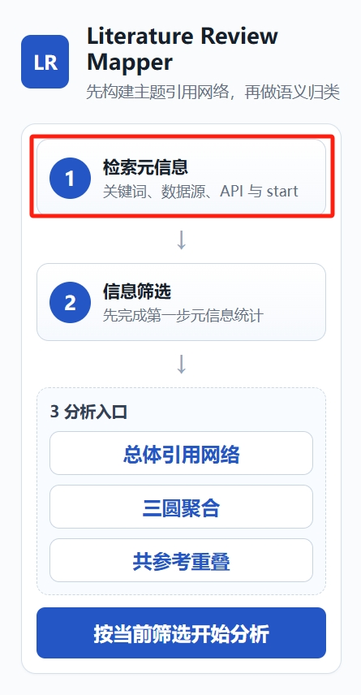
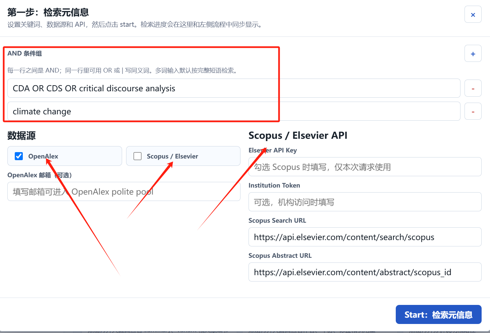
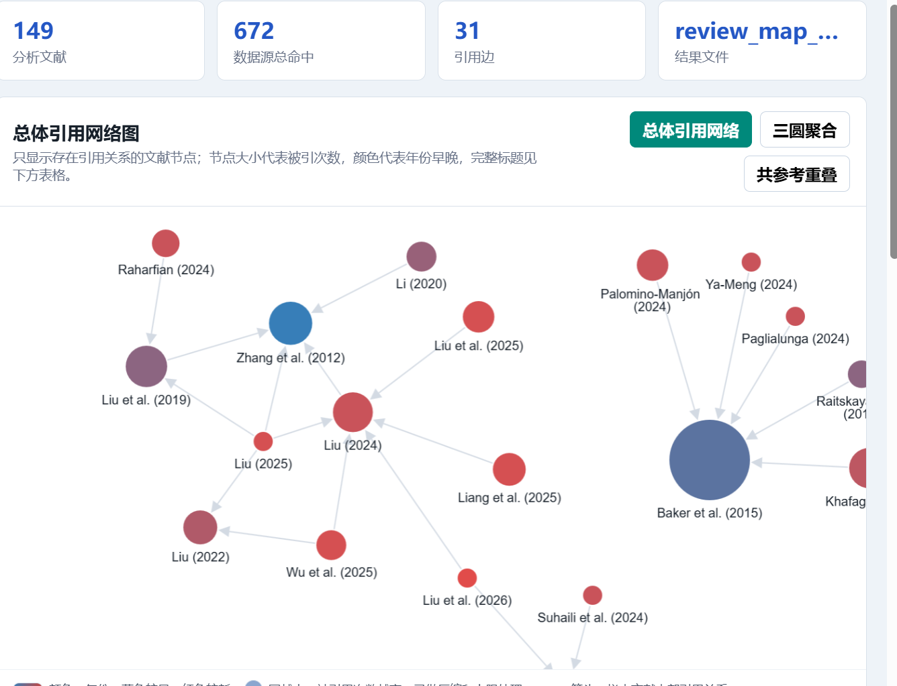
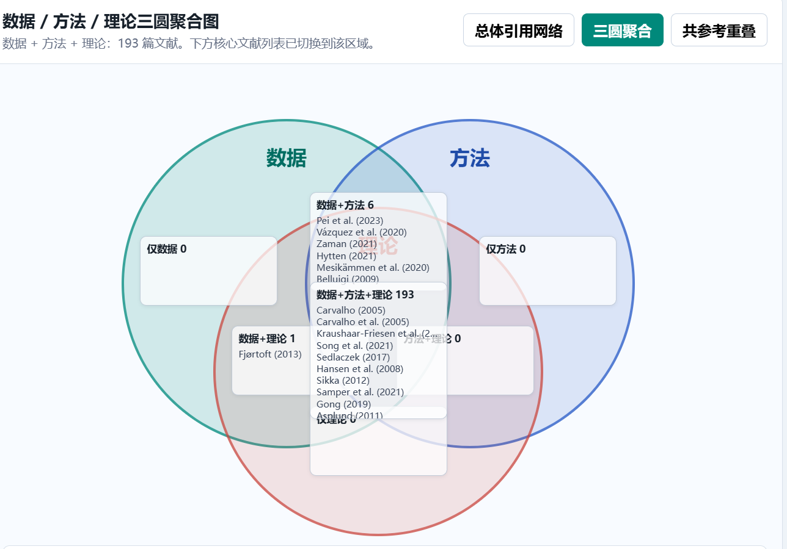

# Literature Review Mapper 使用教程

## 1. 这个工具做什么

Literature Review Mapper 是一个面向文献综述的桌面工具，用来把 OpenAlex 和 Scopus 检索到的文献元信息转成几类分析结果：

- 总体引用网络图：查看样本文献之间是否存在内部引用关系。
- 数据 / 方法 / 理论三圆聚合图：查看文献在数据来源、研究方法、理论框架三个维度上的归类和重叠。
- 共参考重叠网络图：查看两篇文献是否引用了相同参考文献，从而判断知识基础是否相近。
- 关键文献列表：按引用量、年份和语义标签查看核心文献。
- 演化分析：按年份展示较关键文献形成的主题演化路径。

> 注意：三圆分析目前仍不稳定。它依赖摘要文本和语义归类，若摘要缺失、LLM 归类不稳定或文献主题很分散，结果可能需要人工复核。

---

## 2. 隐私与 API Key 说明

应用界面中的 API Key 输入框是密码框，默认没有写入任何值。

- Elsevier / Scopus API Key 只在本次请求中发送给 Elsevier API。
- LLM API Key 只在本次语义归类请求中使用。
- 源码和打包文件不应包含你的个人 API Key。
- 上传或分发前，可以再次用文本搜索确认压缩包中没有你的 Key 明文。

---

## 3. 数据源能力说明

### OpenAlex

OpenAlex 通常能返回：

- 标题
- 年份
- DOI
- 作者
- 摘要倒排索引
- 被引次数
- `referenced_works` 参考文献 ID

因此，总体引用网络和共参考重叠网络主要依赖 OpenAlex 的 `referenced_works` 字段。

### Scopus

Scopus Search API 通常能返回：

- 标题
- 年份
- DOI
- 作者字段或第一作者字段
- 被引次数
- 部分摘要字段

应用会进一步使用 Abstract Retrieval API（`view=FULL`）补全摘要、作者和参考文献列表。具体来说：

- 从 `bibrecord.tail.bibliography.reference` 中提取每条参考文献的 SGR ID。
- 将 SGR ID 转换为 `scopus:SGR_ID` 格式，存入 `referenced_works`。
- 因此 Scopus 文献之间也可以生成引用边和共参考边。

但如果 Abstract Retrieval 请求失败（权限不足、网络超时等），参考文献列表仍可能为空。此时：

- 只选 Scopus 时，总体引用网络可能只有孤立节点，没有引用边。
- 只选 Scopus 时，共参考 / 共被引重叠网络也可能没有连线。
- 如果你需要网络边，建议同时勾选 OpenAlex。

---

## 4. 第一步：检索元信息

在左侧流程图中点击 **1 检索元信息**，会打开设置弹窗。


### 4.1 输入关键词

关键词采用“条件组”逻辑：

- 同一行内部可以写 OR 关系，例如：
  - `digital platform OR platform ecosystem`
- 多行之间是 AND 关系。

例如：

```text
platform ecosystem OR digital platform
innovation OR governance
```

表示检索同时满足“平台生态/数字平台”和“创新/治理”的文献。

### 4.2 选择数据源

可以勾选：

- OpenAlex
- Scopus

建议：

- 需要引用网络和共参考网络时，至少勾选 OpenAlex。
- 需要 Scopus 覆盖率或 Elsevier 元信息时，再同时勾选 Scopus。

### 4.3 设置 API

OpenAlex 邮箱：

- 可选，但建议填写。
- 有助于 OpenAlex polite pool 请求。

Scopus / Elsevier API：

- 勾选 Scopus 时填写 Elsevier API Key。
- 如果学校或机构需要 InstToken，也可以填写。
- 默认 Search URL 和 Abstract Retrieval URL 一般不用改。

### 4.4 点击 Start

点击 start 后，应用会启动后台任务并显示进度条。检索时间较长时不会因为前端等待而自动停止。

检索完成后，你会看到：

- 检索命中数量
- 年份分布
- 文献类型分布
- Scopus 作者 / 摘要补全统计

---

## 5. 第二步：信息筛选

点击左侧流程图中的 **2 信息筛选**，打开大弹窗。

你可以筛选：

- 年份范围
- 文献类型
- 是否排除 book review / review 类文献
- 候选文献数量
- 是否使用 LLM 进行语义归类

筛选完成后点击分析按钮。应用会再次启动后台任务，并显示进度。

---

## 6. 根据语义归类

语义归类会把每篇文献拆成三个维度：

### 6.1 方法 Method

方法指研究设计、分析策略或研究技术。例如：

- Case Study
- Survey
- Experiment
- Interview
- Econometric Modeling
- Network Analysis
- Content Analysis

应用内部使用两层结构：

- `Method Root`：方法大类
- `Method Variant`：更具体的变体

例如：

```text
Method Root: Case Study
Method Variant: Comparative Case Study
```

### 6.2 数据 Data

数据指研究使用的数据来源或材料。例如：

- Survey Data
- Interview Data
- Archival Data
- Patent Data
- Platform Trace Data
- Financial Data
- Case Material

应用内部也使用两层结构：

- `Data Root`：数据大类
- `Data Variant`：更具体的数据来源或材料

### 6.3 理论 Framework

理论指文献使用的解释框架或理论视角。例如：

- Institutional Theory
- Resource-Based View
- Dynamic Capability
- Transaction Cost Economics
- Actor-Network Theory

理论暂时只使用单层：

- `Framework`

---

## 7. 第三步：出图

左侧第三步有三个分析入口：

1. 总体引用网络图
2. 数据 / 方法 / 理论三圆聚合图
3. 共参考重叠网络图

点击不同按钮即可切换图。


---

## 8. 总体引用网络图

总体引用网络图用于显示样本文献之间的内部引用关系。

- 节点：文献。
- 节点大小：被引次数，已做压缩和上限处理。
- 节点颜色：年份渐变，亮蓝较早、亮红较新。
- 箭头：样本文献之间的引用方向。
- 节点大小滑块：图区域上方可拖动调整节点直径（50%～250%）。
- 拖动节点时周围节点产生泡泡式避让。

如果图中没有连线，常见原因是：

- 当前样本文献之间没有互相引用。
- 只使用 Scopus 数据，且 Abstract Retrieval API 未能获取参考文献列表（权限不足或网络超时）。
- OpenAlex 返回的 `referenced_works` 为空或无法和样本文献匹配。

新版界面在没有边时会显示孤立文献节点，并在提示文字中说明原因。

---

## 9. 数据 / 方法 / 理论三圆分析

三圆分别表示：

- 数据：文献有明确 `Data Root`。
- 方法：文献有明确 `Method Root`。
- 理论：文献有明确 `Framework`。

区域含义：

- 仅数据：只有数据明确，方法和理论不明确。
- 仅方法：只有方法明确，数据和理论不明确。
- 仅理论：只有理论明确，数据和方法不明确。
- 数据 + 方法：数据和方法都明确，但理论不明确。
- 数据 + 理论：数据和理论都明确，但方法不明确。
- 方法 + 理论：方法和理论都明确，但数据不明确。
- 数据 + 方法 + 理论：三个维度都明确。
- 三类都不明确：三个维度都没有可靠标签。

三圆区域会显示作者（年份）。点击区域后，会打开对应文献列表。

> 当前三圆功能仍不稳定。它适合辅助查看“哪些文献使用相同方法、数据、理论”，例如 A 和 B 两圆重叠区域表示这些文献同时具备对应两个维度的明确标签。但由于摘要质量和语义分类会影响结果，请把它作为辅助分析，而不是最终结论。

---

## 10. Summary 三列表格

三圆下方的 summary 分成三列：

- 方法
- 数据
- 理论

每一项都可以点击。点击后会显示：

- Root 类别
- Variant 明细
- 对应文献标题
- 作者与年份

这部分用于人工复核语义归类是否合理。

---

## 11. 共参考重叠网络图

共参考重叠网络图严格说是 bibliographic coupling：

- 节点：文献。
- 连线：两篇文献拥有共同参考文献。
- 边越粗：共同参考文献越多。
- 节点越大：被引次数越高。

如果只使用 Scopus 且 Abstract Retrieval 成功获取了参考文献列表，图可以正常生成边。如果 Abstract Retrieval 失败（权限不足或网络超时），图可能没有边。建议同时勾选 OpenAlex 以提高覆盖率。

---

## 12. 关键文献

点击“打开核心文献”弹窗，可以查看当前图或当前三圆区域对应的关键文献。

每篇文献会显示：

- 标题
- 作者
- 年份
- 被引次数
- 综合分数
- 数据 / 方法 / 理论标签

---

## 13. 演化分析

点击“打开图说明”或相关详情入口，可以查看演化路径。

演化路径通常按年份排列，用来辅助判断某个主题或方法如何从早期文献发展到后续文献。

如果演化路径为空，可能是：

- 文献数量太少。
- 年份信息缺失。
- 图中没有足够可连接的文献。

---

## 14. 常见问题

### Q1：为什么 Scopus 作者显示不完整？

Scopus Search API 有时只返回第一作者或 indexed-name。新版程序会优先使用结构化字段组合成：

```text
Surname, Given Name
```

如果没有 given-name，则退回到 indexed-name 或 authname。

### Q2：为什么摘要缺失？

Search API 不一定返回摘要。程序会尝试调用 Abstract Retrieval API 补全，但是否能补全取决于 API 权限和文献记录本身。

### Q3：为什么总体引用网络没有边？

总体引用网络需要参考文献 ID 能互相匹配。OpenAlex 较适合此用途；Scopus Search API 通常不提供完整参考列表。

### Q4：为什么共参考图没有边？

共参考图需要每篇文献都有参考文献列表。只用 Scopus 时经常没有这类数据。

### Q5：为什么三圆归类看起来不准？

三圆依赖摘要语义归类。摘要缺失、术语模糊或 LLM 输出不稳定都会影响结果。建议把三圆结果作为辅助探索，并结合原文人工复核。
